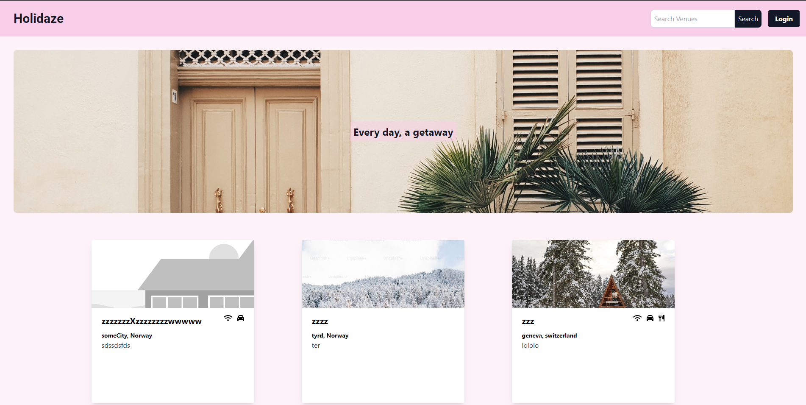

# Holidaze



Holidaze is a web application for our Project Exam 2 at Noroff. You can browse, search, create, book, update and delete venues with this application. To create your own venue you have to sign up as a Venue Manager.

The API provided for this application is provided by Noroff.

Holidaze is built as my final exam at Noroff.

## Live Link:

https://holidaze-pink.netlify.app

## Built with

### Planning

 Trello

### Designing

 Figma

### Language

 HTML5  
 CSS3  
 JavaScript

### Framework

 React
 Tailwind CSS

### Tools

 Vite

# Getting Started

### Installation

1. Clone the project

```shell
   git clone https://github.com/sakonpatsamit/Holidaze-PE2-Sakon-Patsamit
```

2.Install Project dependencies

```shell
   npm install
```

3. To access localhost and start project

```shell
   npm run dev
```

# Contact

any further questions contact at sakonpatsamit@gmail.com
